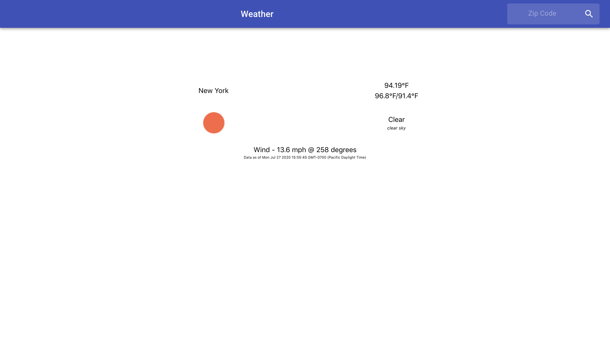

# Weather Application

## Overview

Full stack weather application with third party API from OpenWeather.
Frontend is done with React with backend utilizing Node.js, Express,
and ioredis for Redis. Redis is used for caching results of current weather
and forecasts for the day, leading to fast access to already accessed
data and less API usage. The backend is tied together with Docker and Docker
Compose.

## Installation

- Clone repository and ensure Docker is installed.
- In home directory of repository run `docker-compose up --build` to build and
intialize the docker containers for the backend. 
- `cd` to frontend folder and `npm install` to install necesssary frontend libraries.

## Running

- Backend docker compose should be running already from installation.
- `cd` into frontend directory and run `npm start` to run frontend. 

## Frontend

Frontend utilized react with and Material UI with very basic CSS styling and grid display for mobile friendly responsiveness.

## Backend 

Used Docker Compose to connect both Redis and the Node instance together in one easy to run command. 